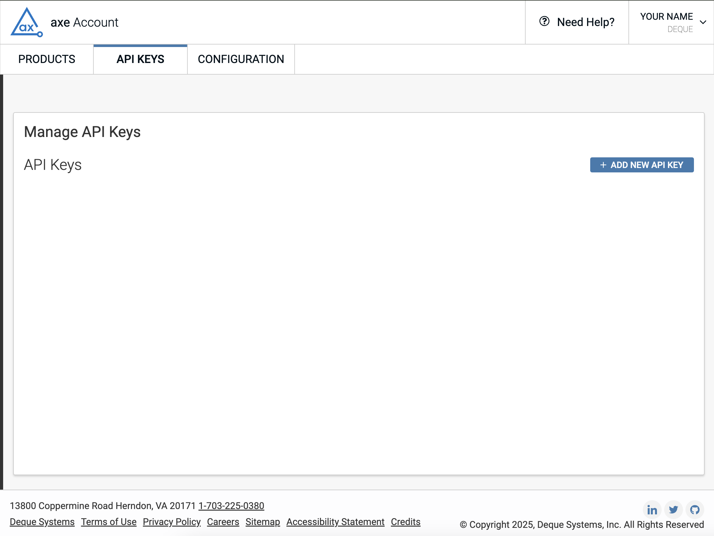
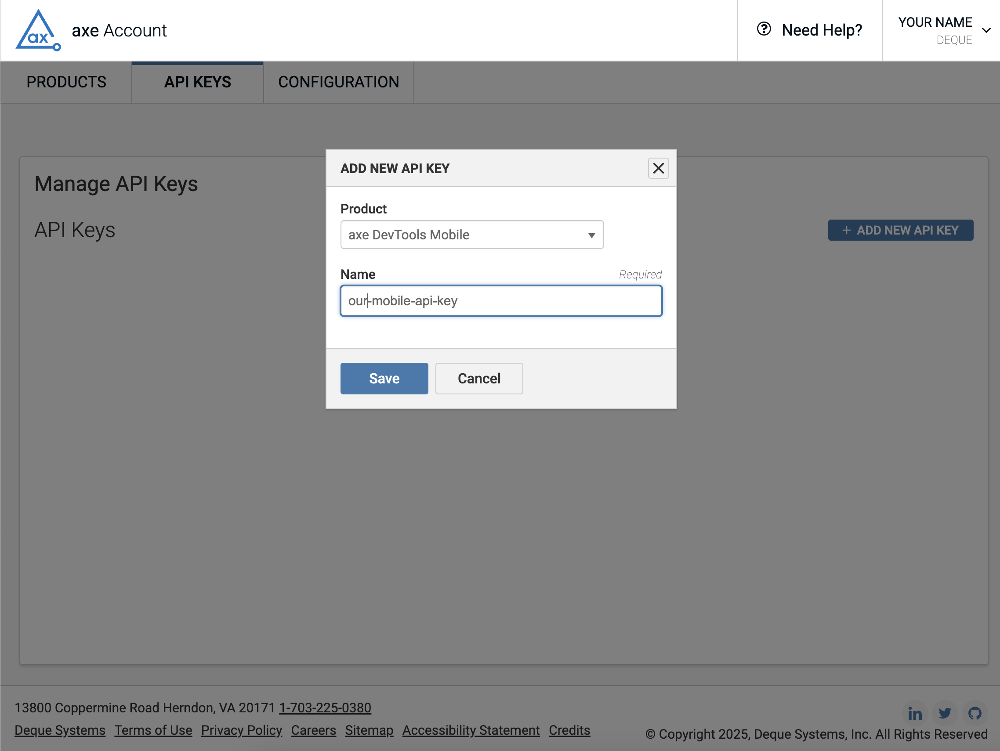
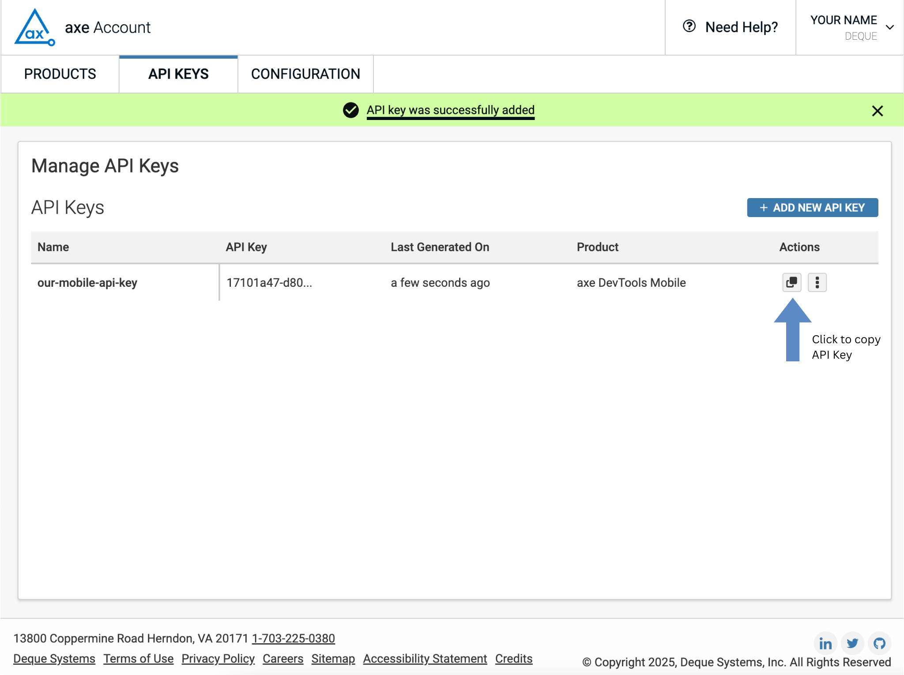

# Obtaining an axe DevTools Mobile API Key

This document describes how to obtain an API key to use with axe DevTools Mobile.

## Background
Perhaps add something here to let people know when the API key is required.
<!-- The axe DevTools Linter SaaS offering needs an API key to authorize your use of the linter-source REST endpoint by adding an Authorization HTTP header to your request. For example, the following shows an example authorization header with a sample API key:
Authorization: cc57ffb2-aa21-4cc2-a11a-0257779b9909
The key is not valid, but is included so you can see what an API key looks like.
 -->
The API key is required when using:
- Appium 
- Mobile Analyzer for iOS

You can use an API Key or username/password for:
- Mobile SDKs
- Mobile Analyzer for Android

## Steps for Obtaining an API Key
In order to obtain an API key for axe DevTools Mobile, you need to have an active free trial or license.
Once you have access, you can obtain an API key by visiting [API Keys](https://axe.deque.com/settings). After you log in, you will see a screen similar to the following:

Click on the ADD NEW API KEY button, and you will see the following:

Make sure you select axe Mobile under **Product**, give the key a **Name**, and click on **Save**.
Finally, Manage API Keys will be displayed, as shown below.

Click on the button indicated by the arrow to copy your new API key to the clipboard. You'll see a message at the top of the screen that indicates that the API key was successfully copied as shown in the above screen shot.

## Next Steps
You can now use your API key to access axe DevTools Mobile.
